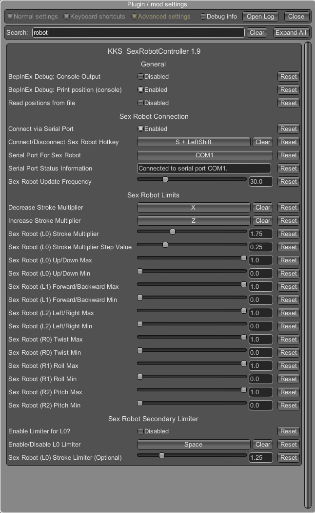
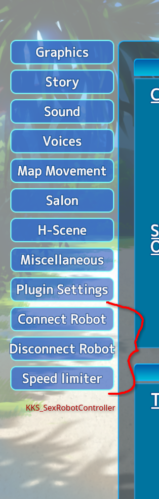
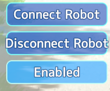
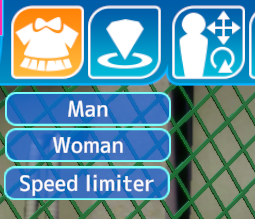

# KKS_SexRobotcontroller
**Koikatsu Sunshine Sex Robot Controller Plugin v1.9**

**Main configuration menu accessed by hitting F1 and then clicking the Plugin settings button**




**Quick access buttons (works in VR) to connect / disconnect your sex robot and to increase / decrease the stroke multiplier**




**Pressing the hotkeys or the quick access buttons to connect / disconnect your sex robot and to increase / decrease the stroke multiplier show feedback text when pressed (especially helpful in VR)**



**Separate button (within the Clothing menu) for enabling or disabling the speed limiter.**


This plugin outputs the positional data from a total of 100 (currently) of the 'HScenes' (sex scenes) in Honey Select 2 with full 6 degrees of freedom (6DOF) in a simple text format known as T-Code (Toy-Code) which is then sent over a serial link (COM port) to drive an open source sex robot (OSR2, OSR2+, SR6, etc).

The 6 total degrees of freedom are:
- L0 (X) Up/Down
- L1 (Y) Forward/Backward
- L2 (Z) Left/Right
- R0 (RX) Twist
- R1 (RY) Roll
- R2 (RZ) Pitch

The male's penis in a given HScene is always aligned with the L0 (X) Up/Down axis, and depending on the HScene/animation in Honey Select 2, 3+ specific 'bones' of the female's vagina, anus, breasts, mouth, or hands are used to calculate and export the necessary 6DOF information to drive the sex robot.

The T-Code format and open source sex robots (OSR2, OSR2+, SR6) were all created/developed by TempestVR. You can find the full/free open sourced OSR2 here: https://www.patreon.com/posts/osr2-1-year-47041804

**Adding animations/positions to file**
When enabling the option to read from file, a file which contains the known animations/positions will be created ("sexRobotController.txt").
The file is only created if it doesn't exists to serve as a template, you can delete everything in the file if you want to.
However, the file with this name must be present for your positions to be read.
The animations are divided into positions (i.e. what body part should be tracked). One of these values must be used in the pairing.

- ORAL
- BREASTS
- LEFTHAND / RIGHTHAND
- INTERCRURAL
- VAGINAL
- ANAL
- LEFTFOOT / RIGHTFOOT / BOTH_FEET

Threesome:
- ORALSWAP
- BREASTSWAP
- LEFTHANDSWAP / RIGHTHANDSWAP
- INTERCRURALSWAP
- VAGINALSWAP
- LEFTFOOTSWAP / RIGHTFOOTSWAP


As can be seen in the file, these are in the format:
```
<animationName>, <bodypart>
```

Some examples:
```
Handjob, LEFTHAND
Sitting Titjob, BREASTS
Sitting side, VAGINAL
```

This need to be a match with the list above, if not there will be no movement.
For example, if the right hand is used in a handjob and the left hand is set to be tracked, there will be no movement, since the part tracked isn't moving.
Animations that aren't listed/known can be printed in the terminal, hence why I recommend first enabling the BepInEx Logging (Plugin settings -> BepInEx -> Logging.Disk -> Enabled).
Then, under the SexRobotController Plugin settings, enable "BepInEx Debug: Print position (console)".

For HS, all the "Foreplay (Receiving)" are not included, the same is true for KKS.
In addition, for KKS, the idle animation name will be printed too: "立ち愛撫" (this can be ignored).

You don't need to restart the game to use the newly added animations, but you do need to execute the following steps to load the recently added animations:
1. Open Plugin settings and for the SexRobotController, disable and then re-enable the "Read positions from file" option.
2. Select a different animation to read the content from file (the content of the file is read once, on animation change)

If after adding a new position (and you've disabled  and re-enabled the "Reaad positions from file"), check the BepInEx Log (found in ""<GameDir>\BepInEx") for errors.
Here is an example of how an error could look like, if an invalid value was added (in this example, the value 'INVALID' was set for the body part, which doesn't exist).

```
[Info   :HS2_SexRobotController] Error updating Animation dictionary: System.ArgumentException: Requested value 'INVALID' was not found.
  at HS2_SexRobotController.FileHandler.readPositionsFromFile () [0x0007c] in <ca2677a8d684461c82753f125094d4f9>:0
  at HS2_SexRobotController.SerialPortConnection.CheckButtonAndSerialConnState () [0x0001a] in <ca2677a8d684461c82753f125094d4f9>:0
```
